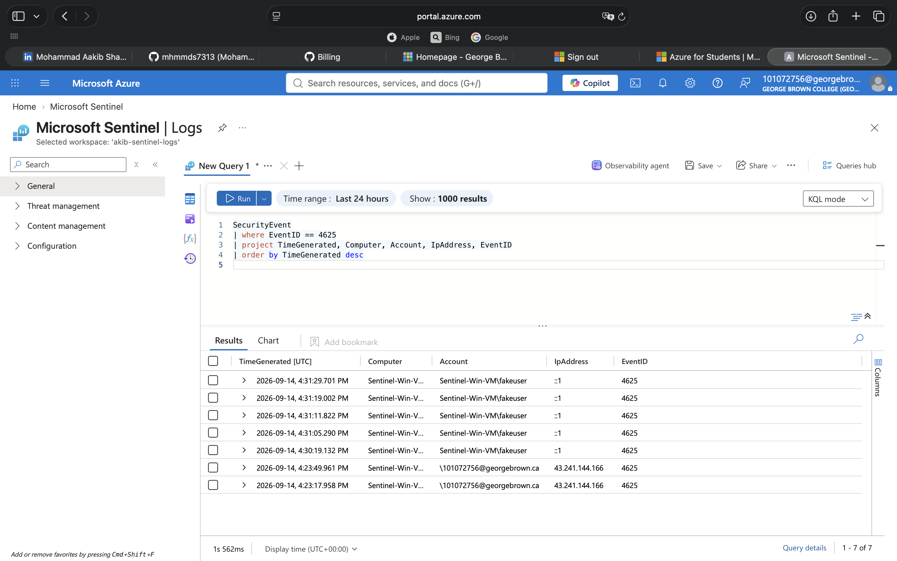
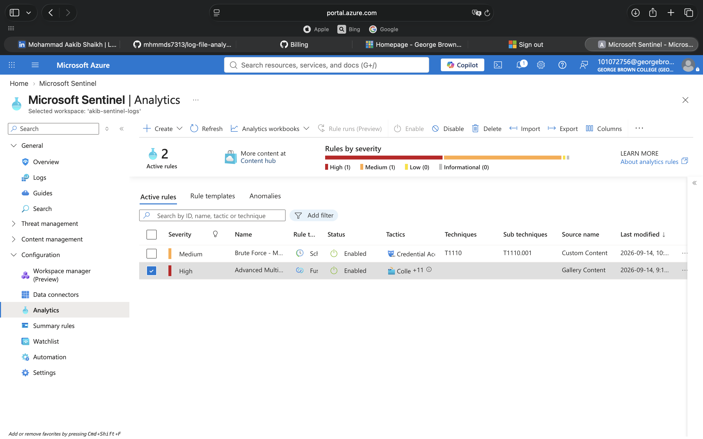

# Microsoft Sentinel Home Lab

I built this lab to get hands-on experience with a real SIEM outside of guided training platforms. The repo covers two things: connecting a Windows endpoint to Sentinel, and building a detection rule on top of it.

---

## Project 1: Log Ingestion & First Query

### What I Used

| Component | What It Was |
|-----------|-------------|
| Cloud | Microsoft Azure (Azure for Students) |
| SIEM | Microsoft Sentinel |
| Workspace | Akib-sentinel-Logs |
| Log Source | Windows VM (Sentinel-Win-VM) |
| Agent | Azure Monitor Agent (AMA) |
| Rule | DCR-Windows-Security-Events |

### How I Set It Up

1. Created a Log Analytics workspace in Azure
2. Turned on Microsoft Sentinel for that workspace
3. Spun up a Windows VM as my test endpoint
4. Installed the Azure Monitor Agent and created a Data Collection Rule to pull Windows Security Events
5. Deliberately failed a login five times to generate Event ID 4625
6. Wrote a KQL query to find those failed logins in Sentinel

The fifth step was the one that made it feel real. Seeing my own failed login attempts show up in a SIEM dashboard is different from reading about it in a course.

### What the Results Looked Like

### What I Learned

- **Patience with ingestion.** After creating the Data Collection Rule, nothing showed up for several minutes. I thought I'd done something wrong. Turns out log ingestion just takes time.
- **The agent has to be there.** No Azure Monitor Agent, no logs. Simple as that.
- **Event ID 4625 is not just one thing.** It captures failed logons from interactive logins, network logins, and service accounts. Context matters when triaging.
- **KQL is actually enjoyable.** Once I got the syntax, filtering and projecting fields felt natural.

---

## Project 2: Brute Force Detection Rule

### What I Used

| Component | What It Was |
|-----------|-------------|
| SIEM | Microsoft Sentinel |
| Query Language | KQL |
| Log Source | Windows Security Events (Sentinel-Win-VM) |
| Event ID | 4625 (Failed Logon) |
| Framework | MITRE ATT&CK T1110 (Brute Force) |
| Schedule | Every 5 minutes, 5-minute lookback |

### How I Set It Up

1. Opened Analytics in Microsoft Sentinel
2. Created a new scheduled query rule
3. Named it "Brute Force - Multiple Failed Logins" and set severity to Medium
4. Mapped it to MITRE ATT&CK T1110 under Credential Access
5. Wrote a KQL query that counts failed logins per computer and account in 5-minute windows
6. Set the rule to fire when that count reaches 5 or more
7. Enabled incident creation so alerts become investigable cases

The whole thing took about 30 minutes, but the thinking behind the threshold took longer. Five failures in five minutes feels like the right balance between catching real attacks and not drowning in noise.

### What the Rule Looked Like

### What I Learned

- **A rule is just a query with a schedule.** The same KQL I used to investigate manually became the backbone of the detection. The only additions were frequency, threshold, and what to do when it fires.
- **MITRE ATT&CK mapping changes how you think.** Once I tagged this as T1110, I started thinking about what an attacker would do next. One alert is never the full story.
- **Thresholds matter.** Five failures in five minutes is aggressive enough to catch brute force but loose enough to avoid alerting on a user who mistyped their password twice. Real tuning is ongoing.
- **Incidents vs. alerts.** Sentinel groups alerts into incidents so analysts investigate one case instead of a hundred notifications. That distinction matters at scale.

---
